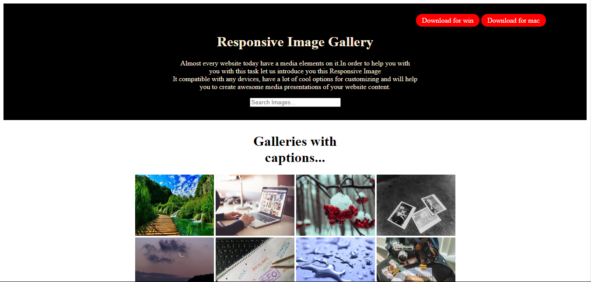

# Hi, I'm Harsh Mishra! 👋

## 🚀 I'm a full-stack developer...

## Project Title - 
### Responsive-Photo-Gallery 

The Responsive Photo Gallery is a dynamic and flexible photo display module designed to adapt seamlessly to any screen size. Built with modern HTML5, CSS3, and JavaScript, this gallery ensures that images are presented in an organized, attractive manner, whether viewed on a mobile device, tablet, or desktop.

## Features:

+ **Responsive Design:** Automatically adjusts layout and image sizes based on the screen resolution.
+ **Grid Layout:** Displays photos in a clean, grid-based layout.
+ **Hover Effects:** Subtle hover animations enhance the user experience without distracting from the content.
+ **Lightbox Support:** Clicking on a photo opens it in a full-size, lightbox-style view for a more immersive experience.
+ **Lazy Loading:** Images are loaded only when they come into the viewport, improving performance and load time.
+ **Cross-Browser Compatibility:** Optimized to work smoothly across all modern web browsers.

## Average time to complete
 1 hrs

## Technology Used

## 🛠 Skills
HTML, CSS

## Demo | Netlify
https://elegant-cranachan-3ecf21.netlify.app/

## Screenshots

## 🤝 Contributing

Contributions are welcome! If you'd like to improve this project, feel free to submit a pull request or open an issue for discussion.

## 📫 Contact
For any questions or feedback, reach out via:

**Email:** hm45676777776@gmail.com

**GitHub:** HarshMishra23

